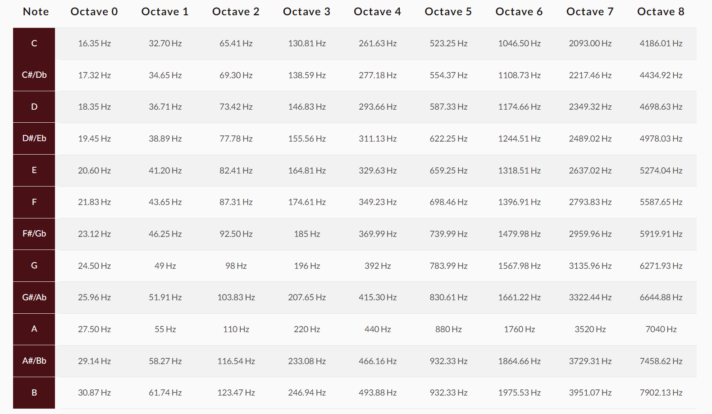

# pitch_detector
Program to detect any pitches from the [chromatic scale](https://en.wikipedia.org/wiki/Chromatic_scale#:~:text=9%20External%20links-,Definition,12%20of%20the%20available%20pitches.) in a piece of recorded audio. See [my blog](https://reneelearnsthings.blogspot.com/) for posts on how I went about researching this.

## Background
### The Chromatic Scale
"The chromatic scale is a musical scale with twelve pitches" ([source](https://en.wikipedia.org/wiki/Chromatic_scale)) - C, C#, D, D#, E, F, F#, G#, A, A#, and B - each of which represents a specific frequency within [an octave](https://en.wikipedia.org/wiki/Octave). An octave is the interval (of frequencies) between two adjacent [harmonic](https://en.wikipedia.org/wiki/Harmonic#:~:text=In%20physics%2C%20acoustics%2C%20and%20telecommunications,are%20known%20as%20higher%20harmonics.) pitches (which in the chromatic scale are [given the same name](https://en.wikipedia.org/wiki/Chromatic_scale#Notation)). The twelve pitches in an octave are [equal-tempered](https://www.britannica.com/art/equal-temperament), meaning each pitch is a multiple of the prior pitch by $2^(1/12)$. See the table below for a look at all the frequencies of each pitch in the chromatic scale.

### The Nyquist Theorem
> The Nyquist theorem states that an analog signal can be digitized without aliasing error if and only if the sampling rate is greater than or equal to twice the highest frequency component in a given signal.
>
> -- <cite>[ScienceDirect](https://www.google.com/search?q=nyquist+theorem&rlz=1C1ONGR_enUS942US942&oq=nyquist+t&gs_lcrp=EgZjaHJvbWUqCggAEAAYsQMYgAQyCggAEAAYsQMYgAQyBggBEEUYOTIHCAIQABiABDIHCAMQABiABDIHCAQQABiABDIHCAUQABiABDIHCAYQABiABDIHCAcQABiABDIHCAgQABiABDIHCAkQABiABKgCALACAA&sourceid=chrome&ie=UTF-8)</cite>

[Most mics are capable of 44.1 kHz](https://resoundsound.com/sample-rate-bit-depth/), which meets the Nyquist requirement for [any frequency hear by the human ear](https://en.wikipedia.org/wiki/Hearing_range).
